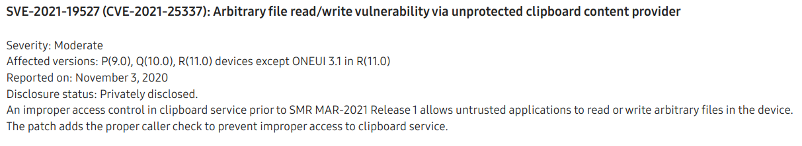

# CVE-2021-25337: Samsung file system r/w in clipboard provider
*Maddie Stone*

## The Basics

**Disclosure or Patch Date:** March 01, 2021

**Product:** Samsung Android

**Advisory:** https://security.samsungmobile.com/securityUpdate.smsb



**Affected Versions:** pre SMR-Mar-2021

**First Patched Version:** SMR-Mar-2021

**Issue/Bug Report:** N/A

**Patch CL:** N/A

**Bug-Introducing CL:** N/A

**Reporter(s):** Anonymous

## The Code

**Proof-of-concept:**

```java
ContentValues vals = new ContentValues();
vals.put("_data", "/data/system/users/0/newFile.bin");
URI semclipboard_uri =    
        URI.parse("content://com.sec.android.semclipboardprovider")
ContentResolver resolver = getContentResolver();
URI newFile_uri = resolver.insert(semclipboard_uri, vals);
return resolver.openFileDescriptor(newFile_uri, "w").getFd();
```

**Exploit sample:** N/A

**Access to the exploit sample?** Yes

## The Vulnerability

**Bug class:** Logic/design flaw, lack of access control

**Vulnerability details:**

There is a custom content provider, `SemClipboardProvider`, running in the system server. A bug in the `SemClipboardProvider` allows `untrusted_app` to indirectly open and create files on the filesystem through `SemClipboardProvider`. The `untrusted_app` can then receive a file descriptor to read and write files that it usually wouldn't be able to open via Linux file permissions or SELinux.

By default, all applications can read from or write to content providers. Apps use permissions in their manifest to control access. System server code is not in an application, but rather a JAR, `services.jar`. The system server's manifest lives in `/system/framework/framework-res.apk`. In this case there were no permissions associated with`SemClipboardProvider` so any apps could read from or write to the table.

```
<provider android:name="com.android.server.semclipboard.SemClipboardProvider" android:enabled="true" android:exported="true" android:multiprocess="false" android:authorities="com.sec.android.semclipboardprovider" android:singleUser="true"/>
```

`SemClipboardProvider` defines two columns for its table: id and \_data. The column name \_data has a special use in Android content providers. It can be used with the `openFileHelper` method to open a file at a specified path. Only the URI of the row in the table is passed to `openFileHelper` and a `ParcelFileDescriptor` object for the path stored in that row is returned. The `ParcelFileDescriptor` class then provides the `getFd` method to get the native file descriptor (fd) for the returned ParcelFileDescriptor.

**Patch analysis:**

Samsung fixed the bug by checking that the UID of the calling process is `system` (UID 1000) prior to executing the `insert` function of the content provider. This check was also added to the `update` and `delete` functions.

Sometime between March 2021 and October 2022 the `SemClipboardProvider` was deleted from the system server. It was moved into the Samsung Keyboard app as `com.samsung.android.honeyboard.icecone.provider.RichcontentProvider`. The Samsung Keyboard app doesn't run as `system` UID.

**Thoughts on how this vuln might have been found _(fuzzing, code auditing, variant analysis, etc.)_:**

This vuln was likely found through code auditing because it would have been pretty obvious to see that there is a lack of access control on both the provider and the function. A static analysis tool could have also been possible.

**(Historical/present/future) context of bug:** 

This bug was used as a part of a chain described in [this blog post](https://googleprojectzero.blogspot.com/2022/11/a-very-powerful-clipboard-samsung-in-the-wild-exploit-chain.html).

## The Exploit

(The terms *exploit primitive*, *exploit strategy*, *exploit technique*, and *exploit flow* are [defined here](https://googleprojectzero.blogspot.com/2020/06/a-survey-of-recent-ios-kernel-exploits.html).)

**Exploit strategy (or strategies):** 

This vulnerability was used 4 different times in the exploit chain. This chain is described in full detail in [this blog post](https://googleprojectzero.blogspot.com/2022/11/a-very-powerful-clipboard-samsung-in-the-wild-exploit-chain.html).

1. Uses it to write the stage 2 ELF to the file system
2. Write to the SamsungTTS app settings file to load the stage 2 ELF
3. Same as 2, but a slightly different path since there are two possible paths for the settings file
4. Open a fd to the dpu driver in order to call an IOCTL on it for the priv esc

**Exploit flow:** N/A

**Known cases of the same exploit flow:** N/A

**Part of an exploit chain?** 

Yes, used in a chain with a kernel info leak and a kernel priv esc. There would have also needed to be a step prior because this exploit would need to be running within some application on the device.

## The Next Steps

### Variant analysis

**Areas/approach for variant analysis (and why):**

**Found variants:** N/A

### Structural improvements

What are structural improvements such as ways to kill the bug class, prevent the introduction of this vulnerability, mitigate the exploit flow, make this type of vulnerability harder to exploit, etc.?

**Ideas to kill the bug class:** 

* Content providers have a defined "Allowed Columns" list to prevent a client adding a `_data` column if it's not expected like the [VoicemailContentTable in AOSP](https://cs.android.com/android/platform/superproject/+/master:packages/providers/ContactsProvider/src/com/android/providers/contacts/VoicemailContentTable.java;drc=d3cf93d7c01809c12525f096ef1e1e840267b33a;l=61).
* If a content provider uses the `_data` column for file access, a content provider path is required to be defined as a part of the definition. Files can only be opened to and from that path. Otherwise, a client can't insert to the `_data` column, only the content provider can.

**Ideas to mitigate the exploit flow:**

**Other potential improvements:**

### 0-day detection methods

What are potential detection methods for similar 0-days? Meaning are there any ideas of how this exploit or similar exploits could be detected **as a 0-day**?

## Other References

* Project Zero Blog on the sample: https://googleprojectzero.blogspot.com/2022/11/a-very-powerful-clipboard-samsung-in-the-wild-exploit-chain.html
