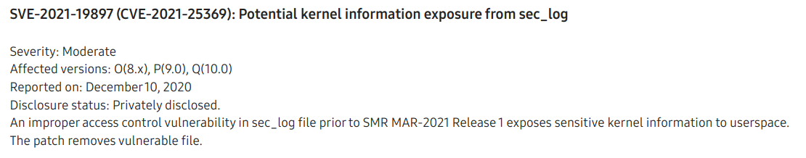

# CVE-2021-25369: Samsung kernel info leak in sec_log
*Maddie Stone*

## The Basics

**Disclosure or Patch Date:** March 01, 2021

**Product:** Samsung Android

**Advisory:** https://security.samsungmobile.com/securityUpdate.smsb



**Affected Versions:** Samsung Exynos, kernel 4.14.113, pre SMR-Mar-2021

**First Patched Version:** SMR-Mar-2021

**Issue/Bug Report:** N/A

**Patch CL:** N/A

**Bug-Introducing CL:** N/A

**Reporter(s):** Anonymous

## The Code

**Proof-of-concept:**

```c
// To triger the WARN_ON
   hwcnt_fd = ioctl(dev_mali_fd, 0x40148008, &v4);
   ioctl(hwcnt_fd, 0x4004BEFE, 0);

// To start the bugreport which writes kmsg contents to /data/log/sec_log.log
   system("setprop dumpstate.options bugreportfull; setprop ctl.start bugreport");
```

**Exploit sample:** N/A

**Access to the exploit sample?** Yes


## The Vulnerability

**Bug class:** Logic/design flaw

**Vulnerability details:**

Usually apps, including system apps, don't have access to `/dev/kmsg`. This vulnerability gave a system app access and thus leaked the `task_struct` and `sys_call_table` addresses. 

`WARN_ON` macros are used in the Linux kernel for debugging kernel failures. When they're hit, a full back trace is logged to kmsg. This full backtrace included raw stack contents, including the `task_struct` and `sys_call_table` addresses. This vulnerabiity is first triggered by hitting a `WARN_ON` statement in the ARM Mali GPU driver. When an invalid ioctl command is passed to the HWCNT driver, the `WARN_ON` is called:

```c
/**
 * kbasep_vinstr_hwcnt_reader_ioctl() - hwcnt reader's ioctl.
 * @filp:   Non-NULL pointer to file structure.
 * @cmd:    User command.
 * @arg:    Command's argument.
 *
 * Return: 0 on success, else error code.
 */
static long kbasep_vinstr_hwcnt_reader_ioctl(
        struct file *filp,
        unsigned int cmd,
        unsigned long arg)
{
        long rcode;
        struct kbase_vinstr_client *cli;

        if (!filp || (_IOC_TYPE(cmd) != KBASE_HWCNT_READER))
                return -EINVAL;

        cli = filp->private_data;
        if (!cli)
                return -EINVAL;

        switch (cmd) {
        case KBASE_HWCNT_READER_GET_API_VERSION:
                rcode = put_user(HWCNT_READER_API, (u32 __user *)arg);
                break;
        case KBASE_HWCNT_READER_GET_HWVER:
                rcode = kbasep_vinstr_hwcnt_reader_ioctl_get_hwver(
                        cli, (u32 __user *)arg);
                break;
        case KBASE_HWCNT_READER_GET_BUFFER_SIZE:
                rcode = put_user(
                        (u32)cli->vctx->metadata->dump_buf_bytes,
                        (u32 __user *)arg);
                break;
        
        [...]

        default:
                WARN_ON(true);    /** Hit here when ioctl command is invalid **/
                rcode = -EINVAL;
                break;
        }

        return rcode;
}
```

Samsung added a custom bugreport service to `dumpstate.rc`. They also added a custom kernel logging where kmsg contents are also copied to `/proc/sec_log`. The customized dumpstate will copy all of the contents (which includes the `WARN_ON` backtrace) to `/data/log/sec_log.log`. The access controls on the `sec_log` file are much more permissive than `/dev/kmsg`.

**Patch analysis:**

* `dumpstate` no longer writes to `sec_log.log`
* Removed the bugreport service from `dumpstate.rc`

Upstream changes made in early 2020 would prevent this vulnerability in the future:

* In February 2020, ARM changed the `WARN_ON` to a `pr_warn` in version r21p0 of the Mali driver. Samsung updated to this version
* In April 2020, [Linux removed](https://git.kernel.org/pub/scm/linux/kernel/git/stable/linux.git/commit/arch/arm64/kernel/traps.c?h=linux-4.14.y&id=6dc0256f802be6bc783fb9542affb48d267f592c) printing the raw stack contents in a backtrace

**Thoughts on how this vuln might have been found _(fuzzing, code auditing, variant analysis, etc.)_:**

This vuln was likely found by investigating what the sec_log is and then looking for a reachable `WARN_ON` that included the `task_struct` pointer and an address that could be used to break KASLR (in this case it's the `sys_call_table` address).

**(Historical/present/future) context of bug:** 

This bug was used as a part of a chain described in [this blog post](https://googleprojectzero.blogspot.com/2022/11/a-very-powerful-clipboard-samsung-in-the-wild-exploit-chain.html).

## The Exploit

(The terms *exploit primitive*, *exploit strategy*, *exploit technique*, and *exploit flow* are [defined here](https://googleprojectzero.blogspot.com/2020/06/a-survey-of-recent-ios-kernel-exploits.html).)

**Exploit strategy (or strategies):** 

The leaked `sys_call_table` address is used to break KASLR.

The leaked `task_struct` is used to get the `addr_limit` pointer, which is used to gain arbitrary kernel read and write.

**Exploit flow:** N/A

**Known cases of the same exploit flow:** 

It's common/standard to use the `task_struct` and `addr_limit` pointer to gain arbitrary kernel r/w. I hadn't previously seen the technique that the exploit used to work around UAO/PAN before. This technique is described in detail in the [blog post](https://googleprojectzero.blogspot.com/2022/11/a-very-powerful-clipboard-samsung-in-the-wild-exploit-chain.html).

**Part of an exploit chain?**

Yes, used in a chain with a kernel info leak and a kernel priv esc. There would have also needed to be a step prior because this exploit would need to be running within some application on the device.

## The Next Steps

### Variant analysis

**Areas/approach for variant analysis (and why):**

Samsung has quite a few modifications to AOSP's dumpstate and logging. Further auditing of this and who has access is probably worthwhile.

The exploit called `setprop ctl.start`. In AOSP, no contexts have general access to `ctl.start`, but on the targeted Samsung phones it's much more permissive. `system_app` even had access. Audit what other services this gives apps access to.

```
allow at_distributor ctl_start_prop:file { getattr map open read };
allow at_distributor ctl_start_prop:property_service set;
allow bootchecker ctl_start_prop:file { getattr map open read };
allow bootchecker ctl_start_prop:property_service set;
allow dumpstate property_type:file { getattr map open read };
allow hal_keymaster_default ctl_start_prop:file { getattr map open read };
allow hal_keymaster_default ctl_start_prop:property_service set;
allow ikev2_client ctl_start_prop:file { getattr map open read };
allow ikev2_client ctl_start_prop:property_service set;
allow init property_type:file { append create getattr map open read relabelto rename setattr unlink write };
allow init property_type:property_service set;
allow keystore ctl_start_prop:file { getattr map open read };
allow keystore ctl_start_prop:property_service set;
allow mediadrmserver ctl_start_prop:file { getattr map open read };
allow mediadrmserver ctl_start_prop:property_service set;
allow multiclientd ctl_start_prop:file { getattr map open read };
allow multiclientd ctl_start_prop:property_service set;
allow radio ctl_start_prop:file { getattr map open read };
allow radio ctl_start_prop:property_service set;
allow shell ctl_start_prop:file { getattr map open read };
allow shell ctl_start_prop:property_service set;
allow surfaceflinger ctl_start_prop:file { getattr map open read };
allow surfaceflinger ctl_start_prop:property_service set;
allow system_app ctl_start_prop:file { getattr map open read };
allow system_app ctl_start_prop:property_service set;
allow system_server ctl_start_prop:file { getattr map open read };
allow system_server ctl_start_prop:property_service set;
allow vold ctl_start_prop:file { getattr map open read };
allow vold ctl_start_prop:property_service set;
allow wlandutservice ctl_start_prop:file { getattr map open read };
allow wlandutservice ctl_start_prop:property_service set;
```

**Found variants:** N/A

### Structural improvements

What are structural improvements such as ways to kill the bug class, prevent the introduction of this vulnerability, mitigate the exploit flow, make this type of vulnerability harder to exploit, etc.?

**Ideas to kill the bug class:**

* Auditing why `kmsg` contents, and other sensitive logs need to be copied to additional, more permissive locations.
* Syncing to upstream Linux kernel and upstream drivers more often. The changes made to the ARM Mali GPU driver (Feb 2020) and the Linux kernel (April 2020) would have prevented this bug. As of the November 2020 update, the Samsung A50 phone didn't have either of these versions.

**Ideas to mitigate the exploit flow:** N/A

**Other potential improvements:** N/A

### 0-day detection methods

What are potential detection methods for similar 0-days? Meaning are there any ideas of how this exploit or similar exploits could be detected **as a 0-day**?

* Maybe detecting if apps are trying to open and read log contents

## Other References 

* Project Zero Blog on the Exploit Chain: https://googleprojectzero.blogspot.com/2022/11/a-very-powerful-clipboard-samsung-in-the-wild-exploit-chain.html