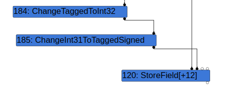
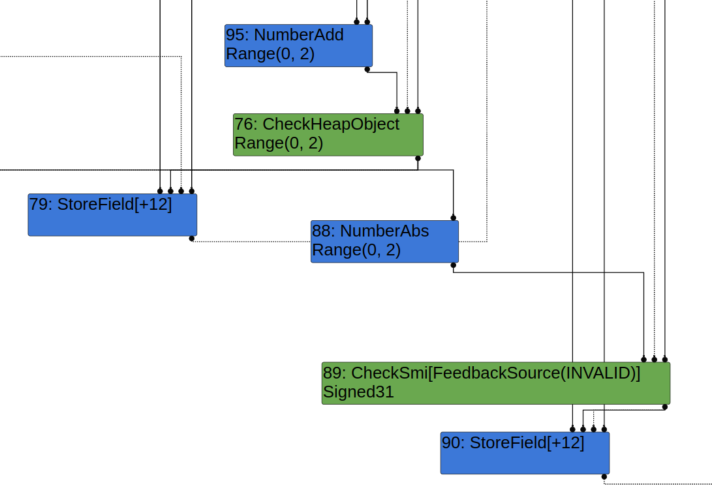
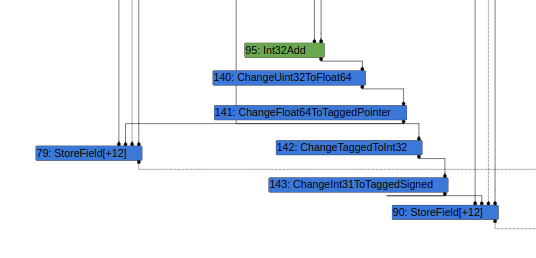
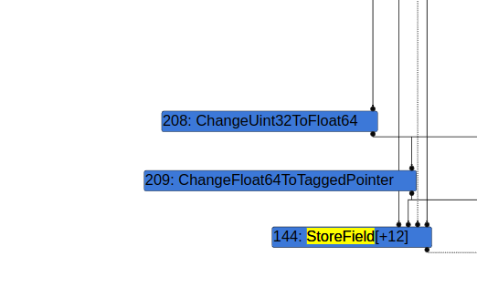

# CVE-2021-4102: Chrome incorrect node elision in Turbofan leads to unexpected WriteBarrier elision
Brendon Tiszka, Chrome

## The Basics

**Disclosure or Patch Date:** December 13, 2021

**Product:** Google Chrome

**Advisory:** https://chromereleases.googleblog.com/2021/12/stable-channel-update-for-desktop_13.html

**Affected Versions:** pre 96.0.4664.110

**First Patched Version:** 96.0.4664.110

**Issue/Bug Report:** [crbug.com/1278387](https://crbug.com/1278387)

**Patch CL:** https://chromium-review.googlesource.com/c/v8/v8/+/3329790

**Bug-Introducing CL:** https://codereview.chromium.org/1908093002

**Reporter(s):**  Anonymous

## The Code

**Proof-of-concepts:**

```javascript
let mark_sweep = () => {
    new ArrayBuffer(2**34);
}

let scavenge = () => {
    let ref = new ArrayBuffer(16777216);
    ref = new ArrayBuffer(1);
    ref = new ArrayBuffer(1);
    ref = null;
}

function noop() {}

{
    // Ensure `o` is a non-const signed field
    var o = {'a':5};
    o.a = 5;

    // Move `o` to OldSpace
    mark_sweep();
    var b;
    function opt() {
        var a1;
        for (var i = 0; i < 2; i++) {
            b = i + -0;
            a1 = Math.abs(b);
            for (var j = 0; j < 2; j++) {}
            for (i = 0; i < 2; i++) {}
            o.a = Math.abs(a1);
            noop();
        }
    }
    %PrepareFunctionForOptimization(opt);
    opt();
    opt();
    %OptimizeFunctionOnNextCall(opt);
    opt();

    // Trigger Scavenger, use-after-free
    scavenge();
    mark_sweep();
    var ret = o.a;
    ret[0];
}
```

**Exploit sample:** No

**Did you have access to the exploit sample when doing the analysis?**
No

## The Vulnerability

**Bug class:** WriteBarrier elision (use-after-free)

**Vulnerability details:**

Prerequisites: 
* V8 has two garbage collection cycles: Scavenger (minor) and Mark-Compact (major). For the purposes of this RCA, the scavenger only collects garbage in the young-generation `NewSpace` and mark-compact collects garbage in all generations `OldSpace` and `NewSpace`.
* Objects in `OldSpace` can hold references to objects in `NewSpace`. WriteBarriers are used to maintain a list of old-to-new references which are [iterated during Scavenge (minor-gc)](https://source.chromium.org/chromium/chromium/src/+/main:v8/src/heap/scavenger.cc;l=684-715;drc=475c8cdf9a951bb06da3084794a0f659f8ef36c2).
* WriteBarriers are only required for pointers to other `HeapObjects`. V8 will ignore WriteBarrier slots that point to `Smis`.
* Turbofan's `SimplifiedLoweringPhase` determines if a WriteBarrier is needed when visiting a `StoreField` node by checking the object's field representation. If the field representation is not a tagged or a tagged pointer, then the [WriteBarrier will be elided](https://source.chromium.org/chromium/chromium/src/+/main:v8/src/compiler/simplified-lowering.cc;l=1528;drc=8f5c47fd8d80208c191fe575f0817b26a9093837).

An optimization in `EarlyOptimizationPhase` that elides `ChangeTaggedToInt32` -> `ChangeInt31ToTaggedSigned` caused a `HeapNumber` to be stored to an object in a field with a `TaggedSigned` representation. A check before `EarlyOptimizationPhase` in `SimplifiedLoweringPhase` makes the _correct_ assumption that write barriers can be elided when storing anything to a field in an object with the `TaggedSigned` representation. This leads to a use-after-free if the `HeapNumber` being mistakenly stored to the object lives in `NewSpace`, and the object being stored to lives in `OldSpace`.

```c++
case IrOpcode::kChangeInt31ToTaggedSigned:
case IrOpcode::kChangeInt32ToTagged: {
    ...
    if (m.IsChangeTaggedToInt32() || ...) {
        return Replace(m.InputAt(0));
    }
}
```

Parts 1 through 4 of the vulnerability details go deep into how to reach this vulnerability.

**_(Part 1): Eliding Write Barriers in Turbofan_**

The bug itself lives in `SimplifiedOperatorReducer`, which runs during the `EarlyOptimizationPhase`. `EarlyOptimizationPhase` is notably after `SimplifiedLoweringPhase` (where the `WriteBarrier` calculation for `StoreField` happens):

```c++
case IrOpcode::kChangeInt31ToTaggedSigned: /*** 1 ***/
case IrOpcode::kChangeInt32ToTagged: {
    Int32Matcher m(node->InputAt(0));
    if (m.HasResolvedValue()) return ReplaceNumber(m.ResolvedValue());
    if (m.IsChangeTaggedToInt32() || m.IsChangeTaggedSignedToInt32()) { /*** 2 ***/
        return Replace(m.InputAt(0)); /*** 3 ***/
    }
    break;
}
```

The bug is simple. When the `SimplifiedOperatorReducer` visits a `ChangeInt31ToTaggedSigned` [1] node, it will elide [3] `ChangeInt32ToTagged` -> `ChangeInt31ToTaggedSigned` [2]. Consider this theoretical sequence of nodes after the `SimplifiedLoweringPhase` which can be emitted when storing to a `TaggedSigned` field:



The input to `ChangeTaggedToInt32` can be either a `Smi` or a `TaggedPointer`. If the input to `ChangeTaggedToInt32` is a `TaggedPointer`, and `ChangeTaggedToInt32` -> `ChangeInt31ToTaggedSigned` is elided, then it will result in an object with a `TaggedPointer` type being stored to an object field whose representation is `TaggedSigned` during `StoreField`.

While the bug is simple, producing the correct sequence of nodes after `SimplifiedLoweringPhase` and coercing `SimplifiedOperatorReducer` into visiting `ChangeInt31ToTaggedSigned` before `ChangeTaggedToInt32` is difficult.

**_(Part 2): Arranging Nodes Pre-Simplified-Lowering_**

Let's take a look at a simplified poc that can be used to create the arrangement of nodes mentioned above after `SimplifiedLoweringPhase`:

```javascript
var o = {'a': 5}; o.a = 6;
var b;
function opt() {
    for (var i = 0; i < 2; i++) {
        b = i + -0;
        o.a = Math.abs(b);
    }
}
```

**Step 1**
```javascript
var o = {'a': 5}; o.a = 6;
```
We start by creating a `JSObject` with a field that has a mutable `TaggedSigned` representation.

**Step 2**
```javascript
var b;
for (var i = 0; i < 2; i++) {
    b = i + -0;
    [...]
}
```
`JSNativeContextSpecialization` will emit a [CheckHeapObject](https://source.chromium.org/chromium/chromium/src/+/main:v8/src/compiler/js-native-context-specialization.cc;l=1257;drc=445f8cfdbb63b29ce44f728f6b5015cf18df5534) node as input to [StoreField](https://source.chromium.org/chromium/chromium/src/+/main:v8/src/compiler/js-native-context-specialization.cc;l=1274;drc=445f8cfdbb63b29ce44f728f6b5015cf18df5534) because we are storing a `HeapNumber` to the global property `b`.

**Step 3**
```javascript
for (var i = 0; i < 2; i++) {
    [...]
    o.a = Math.abs(b);
}
```

Passing `b` to `Math.abs` causes `LoadEliminationPhase` to pass the `CheckHeapObject` node as input to both the `NumberAbs` and the **global** `StoreField` above. `Math.abs` will be reduced to `NumberAbs` and then `JSNativeContextSpecialization` will be reduced to a [CheckSmi](https://source.chromium.org/chromium/chromium/src/+/main:v8/src/compiler/js-native-context-specialization.cc;l=3022;drc=be8f6de811592171739ea8ea326255df6065ce1d) node as input to [StoreField](https://source.chromium.org/chromium/chromium/src/+/main:v8/src/compiler/js-native-context-specialization.cc;l=3105;drc=be8f6de811592171739ea8ea326255df6065ce1d) because the field that's being stored to has the field representation `TaggedSmi`.

Putting all of this together this results in this graph after `LoadEliminationPhase`:




**_(Part 3): Arranging Nodes during SimplifiedLowering_**

These nodes are lowered as follows in the `SimplifiedLoweringPhase`:

1. `NumberAdd` is lowered [to `Int32Add`](https://source.chromium.org/chromium/chromium/src/+/main:v8/src/compiler/simplified-lowering.cc;l=2502;drc=c7feb2cc1656bc5ecaacf082bb1651da5959077c) because its type is `Range(0, 2)`.
2. `CheckHeapObject` is lowered [to `ChangeUint32ToFloat64` -> `ChangeFloat64ToTaggedPointer`](https://source.chromium.org/chromium/chromium/src/+/main:v8/src/compiler/simplified-lowering.cc;l=3647;drc=c7feb2cc1656bc5ecaacf082bb1651da5959077c) because the type of `NumberAdd` is `Range(0, 2)`.
3. `NumberAbs` is lowered [to `ChangeTaggedToInt32`](https://source.chromium.org/chromium/chromium/src/+/main:v8/src/compiler/simplified-lowering.cc;l=2649;drc=7a8373f18e2327d7dc52600fc9e52cc2f5b6abf6) because the type of `CheckHeapObject` is `Range(0, 2)`.
4. `CheckSmi` is lowered [to `ChangeInt32ToTaggedSigned`](https://source.chromium.org/chromium/chromium/src/+/main:v8/src/compiler/simplified-lowering.cc;l=3230;drc=7a8373f18e2327d7dc52600fc9e52cc2f5b6abf6) because the type of the `NumberAbs` node is `Range(0, 2)`.




This results in the above graph which **appears** to satisfy all of the conditions that we need to trigger this vulnerability and store a `TaggedPointer` to a field with a `smi` representation without a write barrier because `ChangeUint64ToFloat64` -> `ChangeFloat64ToTaggedPointer` -> `ChangeTaggedToInt32` -> `ChangeInt31ToTaggedSigned` -> `StoreField` should be elided directly to `ChangeUint64ToFloat64` -> `ChangeFloat64ToTaggedPointer` -> `StoreField`.

**_(Part 4): Traversing the Graph_**

Turbofan's [GraphReducer algorithm](https://source.chromium.org/chromium/chromium/src/+/main:v8/src/compiler/graph-reducer.cc;l=148;drc=8f5c47fd8d80208c191fe575f0817b26a9093837) is a modified version of depth-first-search. It starts from the `kEnd` node and recurses up node inputs from left to right until it reaches a node that has either seen before or until all of its inputs have been visited. The order in which nodes are visited is important triggering this bug. For example, the simple proof-of-conept from Part2/Part3 does not reach the vulnerability because `ChangeTaggedToInt32` is visited before the `ChangeInt31ToTaggedSigned`.

```c++
case IrOpcode::kChangeTaggedSignedToInt32:
case IrOpcode::kChangeTaggedToInt32: {
    NumberMatcher m(node->InputAt(0));
    if (m.HasResolvedValue())
        return ReplaceInt32(DoubleToInt32(m.ResolvedValue()));
    if (m.IsChangeFloat64ToTagged() || m.IsChangeFloat64ToTaggedPointer()) {
        return Change(node, machine()->ChangeFloat64ToInt32(), m.InputAt(0)); /*** A ***/
    }
    if (m.IsChangeInt31ToTaggedSigned() || m.IsChangeInt32ToTagged()) {
        return Replace(m.InputAt(0));
    }
    break;
}
```

This happens because the graph is traversed with DFS starting from `End`, we will always visit `ChangeTaggedToInt32` before `ChangeInt31ToTaggedSigned` with that graph because `ChanteTaggedToInt32` only has one output and `ChanteInt32ToTaggedSigned` only has one input. `ChangeTaggedToInt32` is guaranteed to be reduced before `ChangeInt31ToTaggedSigned`:


When this happens, `SimplifedOperatorReducer` elides `ChangeUint64ToFloat64` -> `ChangeFloat64ToTaggedPointer` -> `ChangeTaggedToInt32` -> `ChangeInt31ToTaggedSigned` -> `StoreField` to `ChangeUint64ToFloat64` -> `ChangeFloat64ToInt32` -> `ChangeInt31ToTaggedSigned` -> `StoreField` [A] which is semantically valid and does not introduce a security issue.

To get around this, the final proof of concept intricately and cleverly creates multiple `FrameState`, `StateValue`, and `CheckPoint` nodes that take `ChangeTaggedToInt32` as an input, causing the GraphTraversal to push `ChangeTaggedToInt32` on the stack before reaching `ChangeInt31ToTaggedSigned`. This causes the GraphTraversal for `SimplifiedOperatorReducer` to stop at `ChangeInt31ToTaggedSigned` because `ChangeTaggedToInt32` is already on the stack. Finally, `ChanteTaggedToInt32` -> `ChanteInt31ToTaggedSigned` is elided.




**Patch analysis:** Commit [4fae8b1](https://chromium-review.googlesource.com/c/v8/v8/+/3329790) fixed the bug in `SimplifiedOperatorReducer` that could cause `ChangeTaggedToInt32` -> `ChangeInt31ToTaggedSigned` to be elided.

**Thoughts on how this vuln might have been found _(fuzzing, code auditing, variant analysis, etc.)_:**

The bug was probably discovered through manual analysis.

**(Historical/present/future) context of bug:**

There was a bug in Turbofan's handling of WriteBarriers in the past during `SimplfiedLoweringPhase` [crbug.com/791245](crbug.com/791245). However, CVE-2021-4102 was the first bug of its kind that bypassed that check in a later optimization pass.

## The Exploit

(The terms *exploit primitive*, *exploit strategy*, *exploit technique*, and *exploit flow* are [defined here](https://googleprojectzero.blogspot.com/2020/06/a-survey-of-recent-ios-kernel-exploits.html).)

**Exploit strategy (or strategies):** We did not have an exploit sample while analyzing this vulnerability, but it is reasonable to assume that the use-after-free was used to either leak a sentinel value like `TheHole` or `UninitializedOddball` or to directly materialize a fake object similar to [crbug.com/1307610](https://crbug.com/1307610).

**Exploit flow:**  A typical exploit will first construct an arbitrary read/write primitive, then use that to gain shellcode execution.

**Known cases of the same exploit flow:** Most other V8 exploits.

**Part of an exploit chain?** N/A

## The Next Steps

### Variant analysis

**Areas/approach for variant analysis (and why):**
* Manual Variant Analysis: Look at other reduction passes after `SimplifiedLoweringPhase` that could be abused to cause unexpected WriteBarrier elision.

**Found variants:**
* [crbug.com/1307610](https://crbug.com/1307610) discovered by Brendon Tiszka is not a direct variant of this vulnerability, however it is another WriteBarrier elision bug and was reported after root-causing this vulnerability.
* [crbug.com/1382434](https://crbug.com/1382434) discovered by Sergei Glazunov of Google Project Zero is not a variant of this vulnerability, however it uses WriteBarrier elision to exploit a class of vulnerabilty.
* [crbug.com/1423610](https://crbug.com/1423610) discovered by Nan Wang and Zhenghang Xiao of Qihoo360 is another WriteBarrier elision bug in V8's Maglev JIT compiler.

### Structural improvements

What are structural improvements such as ways to kill the bug class, prevent the introduction of this vulnerability, mitigate the exploit flow, make this type of vulnerability harder to exploit, etc.?

**Ideas to kill the bug class:** N/A

**Ideas to mitigate the exploit flow:** The V8 Sandbox project is designed to break this exploit flow for the vast majority of V8 vulnerabilities, including this one.

**Other potential improvements:** 
N/A

### 0-day detection methods

What are potential detection methods for similar 0-days? Meaning are there any ideas of how this exploit or similar exploits could be detected **as a 0-day**? N/A

## Other References 
* A WriteBarrier elision [hole leaking technique](https://bugs.chromium.org/p/chromium/issues/detail?id=1307610#c5) and a WriteBarrier elision fake object technique - [exploit](https://bugs.chromium.org/p/chromium/issues/detail?id=1307610#c43) - are publicly documented.
