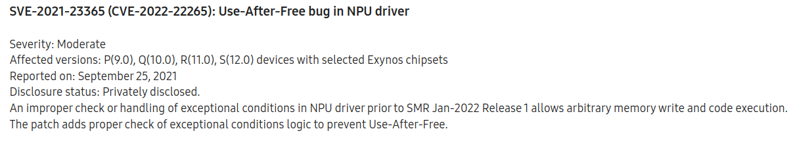

# CVE-2022-22265: Samsung NPU device driver double free in Android

Xingyu Jin, Android Security Research

## The Basics

**Disclosure or Patch Date:** Jan 01, 2022

**Product:** Samsung Android

**Advisory:** https://security.samsungmobile.com/securityUpdate.smsb



**Affected Versions:** Samsung Exynos with NPU, pre SMR-Jan-2022

**First Patched Version:** SMR-Jan-2022

**Issue/Bug Report:** N/A

**Patch CL:** N/A

**Bug-Introducing CL:** N/A

**Reporter(s):** Seonung Jang of STEALIEN

## The Code

**Proof-of-concept:** N/A

**Exploit sample:** N/A

**Did you have access to the exploit sample when doing the analysis?** Yes

## The Vulnerability

**Bug class:** Double free

**Vulnerability details:**

There is a double free vulnerability in the Samsung NPU (`/dev/vertex10`) on the formats within the `vb_queue` struct (`q->format.formats`):

```c
struct vb_queue {
	...
	struct vb_format_list		format;
	...
}

struct vb_format_list {
	u32				count;
	struct vb_format		*formats;   /** double free **/
};
```

The vulnerable function `vb_queue_s_format(struct vb_queue *q, struct vs4l_format_list *flist)` is in `drivers/vision/vision-core/vision-buffer.c` where the `vb_queue` is used for queuing the vision information `flist` based on user input. 

After the NPU is initialized, the first free is triggered by calling the ioctl `VS4L_VERTEXIOC_S_FORMAT` with an invalid `format_list` (`flist`) argument. The `VS4L_VERTEXIOC_S_FORMAT` ioctl is handled by the `npu_vertex_s_format`. `npu_vertex_s_format` calls `npu_queue_s_format` which calls `vb_queue_s_format(queue, flist)`, passing the invalid `format_list` argument. In `vb_queue_s_format`, the function `__vb_find_format` attempts to locate the passed in format [1], but since the argument passed in is invalid, that call will fail [2] and `q->format.formats` will be freed [3] for the first time:

```c
int vb_queue_s_format(struct vb_queue *q, struct vs4l_format_list *flist)
{
       int ret = 0;
        u32 i;
        struct vs4l_format *f;
        struct vb_fmt *fmt;

        q->format.count = flist->count;
        q->format.formats = kcalloc(flist->count, sizeof(struct vb_format), GFP_KERNEL);
        if (!q->format.formats) {
                vision_err("q->format.formats is NULL\n");
                ret = -ENOMEM;
                goto p_err;
        }

        if (q->format.count > VB_MAX_BUFFER) {
                vision_err("flist->count(%d) cannot be greater to VB_MAX_BUFFER(%d)\n", flist->count, VB_MAX_BUFFER);
                ret = -EINVAL;
                kfree(q->format.formats);
                goto p_err;
        }

        for (i = 0; i < flist->count; ++i) {           
                f = &flist->formats[i];

                fmt = __vb_find_format(f->format);                 /** [1] **/
                if (!fmt) {
                        vision_err("__vb_find_format is fail\n");
                        kfree(q->format.formats);                       /** [3] **/
                        ret = -EINVAL;
                        goto p_err;
                }
       [...]
}

static struct vb_fmt *__vb_find_format(u32 colorspace)
{
	size_t i;
	struct vb_fmt *fmt = NULL;			     

	for (i = 0; i < ARRAY_SIZE(vb_fmts); ++i) {
		if (vb_fmts[i].colorspace == colorspace) {
			fmt = &vb_fmts[i];
			break;
		}
	}
	return fmt;		 /** [2] return NULL because colorspace from f->format is an invalid value **/
}
```

The second free can be triggered by calling ioctl `VS4L_VERTEXIOC_STREAM_OFF`. The function `npu_vertex_streamoff` handles this ioctl. `npu_vertex_streamoff` calls `npu_queue_stop` which calls `vb_queue_stop` to clean up the queue related data structures. `vb_queue_stop` calls `kfree(q->format.formats)` on the previously freed `q->format.formats` as a part of the clean-up process.

```c
static int __vb_queue_stop(struct vb_queue *q, int is_forced)
{
    [...]
        kfree(q->format.formats);
    [...]
}
```

**Patch analysis:**

The patch clears the pointer `q->format.formats` in `vb_queue_s_format` after it is freed.

```c
int vb_queue_s_format(struct vb_queue *q, struct vs4l_format_list *flist)
{
    int ret = 0;
    u32 i;
    struct vs4l_format *f;
    struct vb_fmt *fmt;

    q->format.count = flist->count;
    q->format.formats = kcalloc(flist->count, sizeof(struct vb_format), GFP_KERNEL);
    ...

    for (i = 0; i < flist->count; ++i) {
        f = &flist->formats[i];

        fmt = __vb_find_format(f->format);
        if (!fmt) {
            vision_err("__vb_find_format is fail\n");
+   	    if (q->format.formats)
                kfree(q->format.formats);
+       	q->format.formats = NULL;
            ret = -EINVAL;
            goto p_err;
        }
        ...
    }
    ...
}
```

Depending on the exact NPU driver version, there could be 2 or 3 similar code paths in freeing `q->format.formats` when an error occurs. Based on our analysis, all of them were fixed.

**Thoughts on how this vuln might have been found _(fuzzing, code auditing, variant analysis, etc.)_:**

The bug was likely discovered while performing variant analysis on  [CVE-2020-28343](https://bugs.chromium.org/p/project-zero/issues/detail?id=2073). The discovered exploit sample modified the public PoC for CVE-2020-28343.

**(Historical/present/future) context of bug:** 

CVE-2022-22265 was reported by researcher Seonung Jang in September 2021. However, there is an in-the-wild exploit sample exploiting this bug from early 2021. Notably, in early 2021 when this exploit sample was discovered, an unprivileged user could access the Samsung NPU device driver `/dev/vertex10` without being restricted by the SELinux policy. This changed sometime in mid 2021.

Based on analyzing the firmware, it appears this bug has existed since the debut of the Samsung NPU in the S10, Exynos 9820 chipset (SM-G973F, G973FXXU4CTC9). The bug also affected other Samsung Exynos devices, like the Samsung S20 (G980FXXU1ATBM). The first patched version appears to be G980FXXUBDUI5 from September 2021.

## The Exploit

(The terms *exploit primitive*, *exploit strategy*, *exploit technique*, and *exploit flow* are [defined here](https://googleprojectzero.blogspot.com/2020/06/a-survey-of-recent-ios-kernel-exploits.html).)

**Exploit strategy (or strategies):**

The exploit triggers an error handling path inside of the kernel function `vb_queue_s_format` and frees a large allocated kernel object. The syscall `select` is abused to occupy the freed kernel object. Next, the exploit frees the object again by ioctl `VS4L_VERTEXIOC_STREAM_OFF` and occupies the freed kernel object with a set of `pipe_buffer` structures using `fcntl(fd, F_SETPIPE_SZ, size)`. After waking up the thread which calls `select`, the file descriptor bitmasks returned by `select()` will contain a leaked `pipe_buffer` kernel object. To implement the arbitrary read / write primitive, the exploit implements the Kernel Space Mirroring Attack (KSMA) attack by spamming page tables to reuse the pipe page that the leaked pipe_buffer pointed to, and then overwriting the page table by writing into the pipe.

**Exploit flow:** 

There is a double free where the attacker can specify the size of the affected kernel objects and control the timing of the second free, making the vulnerability easy to exploit with promising success rate. The double free is first used as a kernel info leak and then the exploit gains an arbitrary r/w primitive using a KSMA attack. When the exploit was in use in early 2021, this vulnerability could be triggered from the `untrusted_app` context to then gain arbitrary kernel r/w.

**Known cases of the same exploit flow:** Yes

**Part of an exploit chain?** Unknown, but likely since this vulnerability is a local privilege escalation bug.

## The Next Steps

### Variant analysis

**Areas/approach for variant analysis (and why):** The code logic is not complex, researchers can audit the source code or fuzz all ioctl calls to cover error handling paths.

**Found variants:** N/A

### Structural improvements

What are structural improvements such as ways to kill the bug class, prevent the introduction of this vulnerability, mitigate the exploit flow, make this type of vulnerability harder to exploit, etc.?

**Ideas to kill the bug class:** Set a pointer to NULL after free.

**Ideas to mitigate the exploit flow:** 

**Other potential improvements:** 

### 0-day detection methods

What are potential detection methods for similar 0-days? Meaning are there any ideas of how this exploit or similar exploits could be detected **as a 0-day**?

Potential signal: Trace every IOCTL call for identifying and validating arguments. Report if any invalid arguments are found.

## Other References